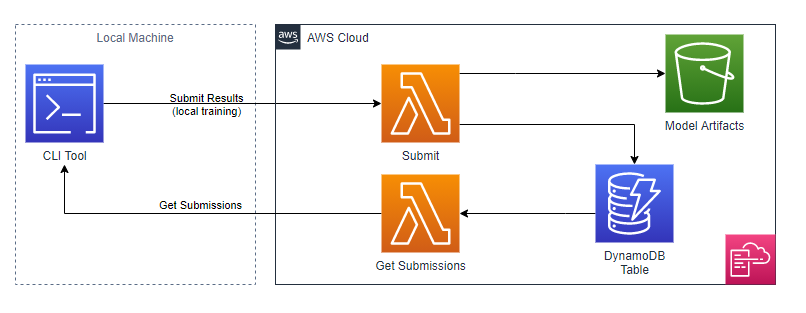

# ml-training-leaderboard
CL Tool for Submitting Models and Tracking Performance Leaderboards



## Deploy to your AWS Account

Requires [AWS CLI 2.x](https://docs.aws.amazon.com/cli/latest/userguide/install-cliv2.html) to deploy via shell script

```bash
sh deploy.sh
```

## TODO's
- [x] reads in complete training json files
  - complete_model / model_name /model_metadata.json
  - complete_model / model_name / ip / hyper_parameters.json
  - complete_model / model_name / training_parametersXXXXX.json
  - complete_model / model_name / eval_parametersXXXXX.json
  - complete_model / model_name / metrics / training / trainingXXXX.json
- [x] writes out to model_data.json file
- [x] writes model_data.json file to DynamoDB record
- [x] retrieves user specified DynamoDB records
